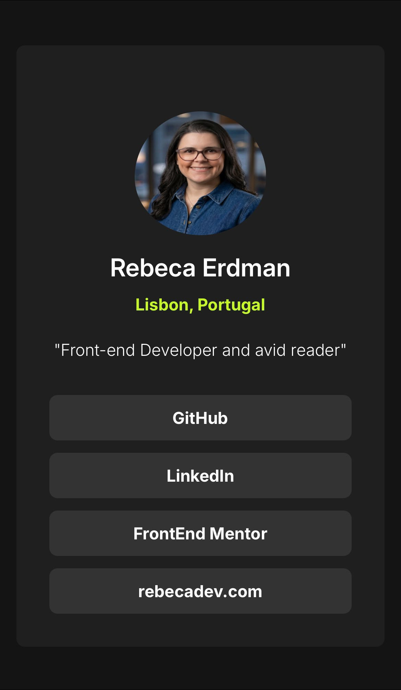
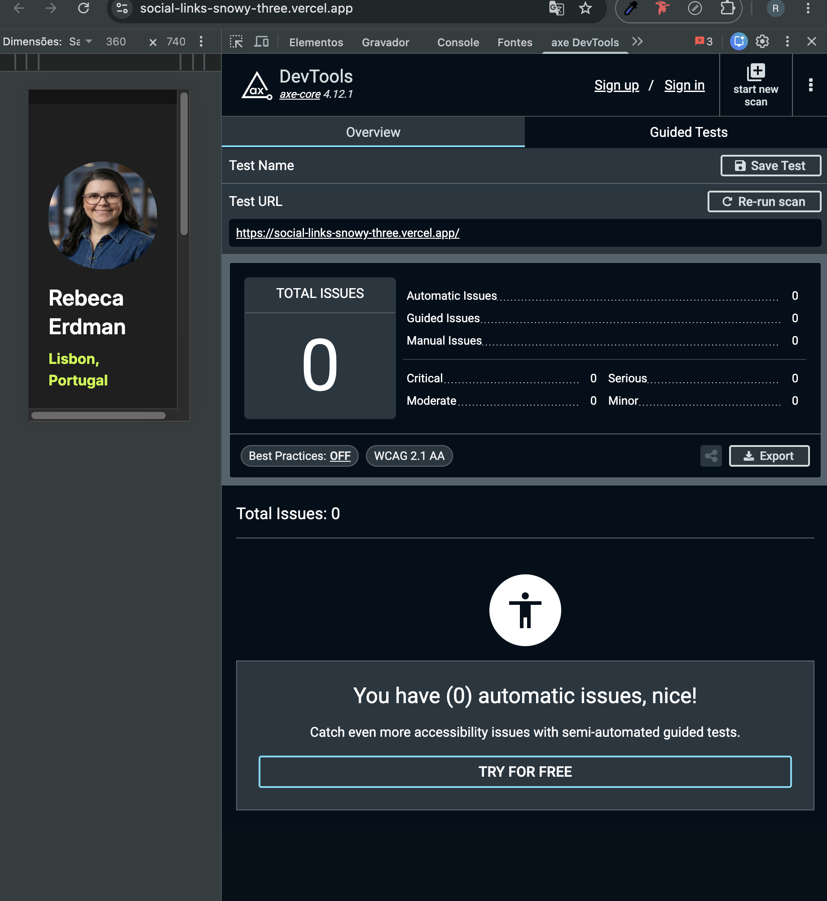

# 🌐 Social Links Profile

A highly responsive and performant application developed to consolidate modern Frontend development practices, quality engineering, and digital accessibility.



## 🔗 Project Link
👉 **[Live Application](https://social-links-snowy-three.vercel.app/)**

---

## 🚀 Technologies Used

- **React 18 & TypeScript** — Strongly typed, reliable component architecture.
- **Tailwind CSS** — Utility-first styling and fluid responsive design.
- **Vitest & React Testing Library (RTL)** — Automated testing suite.
- **ESLint & Prettier** — Quality Gates enforcing strict code consistency and style standards.
- **GitHub Actions** — Continuous Integration (CI) pipeline.
- **Vercel** — Automated deployment synced seamlessly with the repository.

---

## 🛠️ Engineering Practices & Quality Gates

To ensure code robustness and maintainability, this project implements a strict quality pipeline:

### ⚙️ Linters and Formatting
Code is statically analyzed using **ESLint** coupled with **Prettier**. This setup intercepts potential bugs (such as unused variables or orphaned imports) instantly and ensures that code indentation remains rigorously standardized.

### 🧪 Automated Testing
The testing suite covers different levels of the application:
- **Unit Testing:** Isolated component validation (e.g., verifying props, links, and security attributes on the `<Link />` component).
- **Integration Testing:** Assuring that the entire component tree (e.g., `<App />` managing multiple `<Link />` components) interacts and renders the application state correctly.

### 🛡️ Continuous Integration (CI)
Powered by **GitHub Actions**, every `push` or `pull_request` triggers a temporary Linux virtual environment that installs dependencies, executes the linter (`npm run lint`), and runs the test suite (`npm run test -- --run`). Production deployments are only updated if the code passes through this quality gate undefeated.

---

## ♿ Accessibility (a11y)

The project has been audited using **axe DevTools** and achieved a flawless score of **0 accessibility issues (Total Issues: 0)**, strictly complying with international **WCAG 2.1 AA** guidelines:



- **Semantic Structure:** Strict use of semantic HTML tags (`<main>`, `<a>`).
- **Keyboard Navigation:** Full support for users navigating without a mouse, using highly visible and clear focus rings (`focus:outline`).
- **Security & SEO:** Appropriate security attributes applied to all external links (`rel="noreferrer"`).
- **Contrast:** Validated color contrast ratios, ensuring optimal readability for users with low vision.

---

## 📦 Local Setup and Installation

1. Clone the repository:
   ```bash
   git clone https://github.com/rebecafloriano/social-links

2. Install dependencies: 

  `npm install`


3. Run the development server:

  `npm run dev`


## 🔬 Available Commands

`npm run lint`: Runs static analysis via ESLint.

`npm run lint:fix`: Automatically fixes formatting and style deviations.

`npm run format`: Formats all project files using Prettier.

`npm run test`: Launches Vitest in watch mode.
